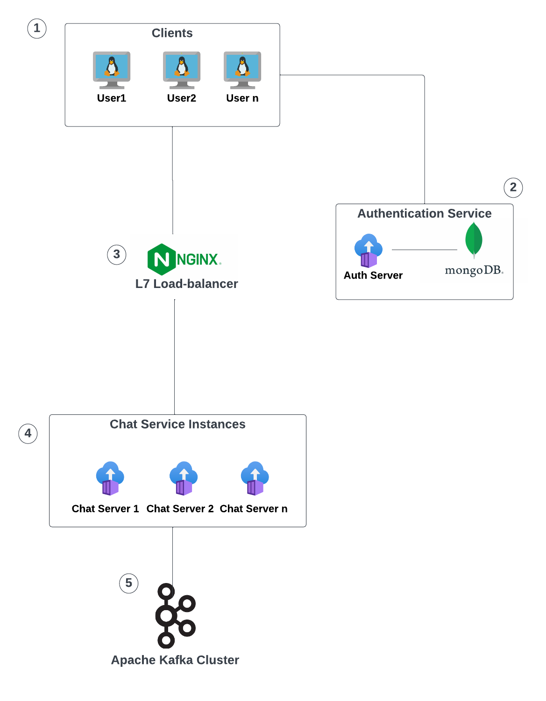

# Details
This is a project to experiment with building a highly scalable chatapp using Angular, Spring-Boot, MongoDB, Nginx, and Apache Kafka
# Higher Level Design:

- Responsive Angular Front-End application used for Logging-In, Registering, Searching, and messaging other member on the platform.
- Authentication Server powered by Spring-Boot RESTful Services is used for Authentication and session management (via producing JWT token) with the help of a MongoDB database used to store persisent data.
- NGINX acts as the Reverse Proxy Loadbalancer used to authenticate (JWT validation) and distribute traffic evenly through the microservices of the system.
- Chatapp Servers powered by Spring-Boot is used to manage the apps chat services using WebSockets as the API protocol for real-time messaging with the Front-End (note: max 100 concurrent connections per server).
- Apache Kafka is the service used to store all the clients chat logs to provide a very fast, fault tolerant, and highly scalable real-time messaging system.
# Port Allocation For Experimentation
- NGINX: 60430
- Chatapp site (Angular Frontend): 4200
- Authentication Server: 26000
- MongoDB Server: 54677
- Chatapp Server instance 1: 53000
- Chatapp Server instance 2: 53001
- Chatapp Server instance 3: 53002
- Chatapp Server instance 4: 53003
- Chatapp Server instance 5: 53004
- Apache  Zookeeper: 53410
- Apache Kafka Broker 1: 53620
- Apache Kafka Broker 2: 53621
- Apache Kafka Broker 3: 53622
- Apache Kafka Broker 4: 53623
- Apache Kafka Broker 5: 53624

